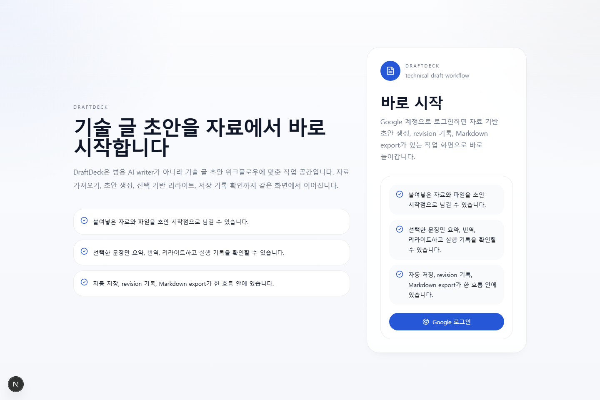
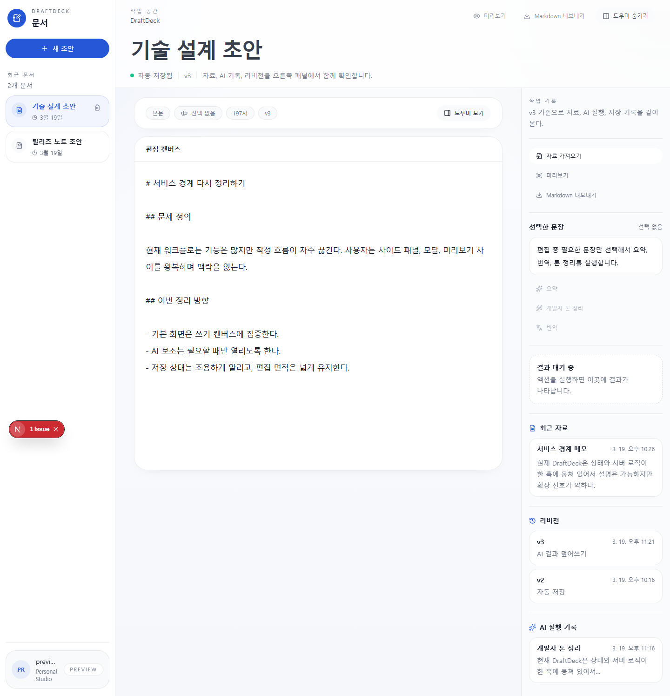
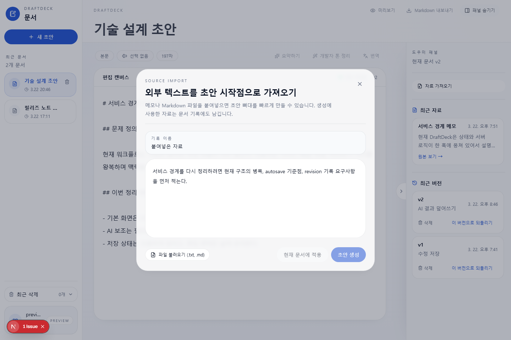
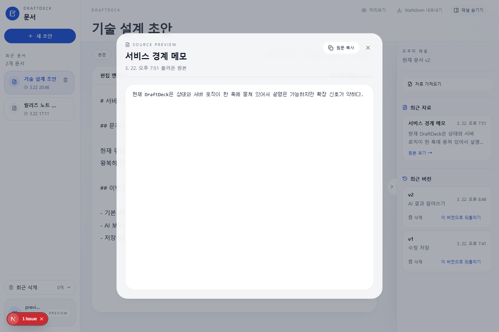
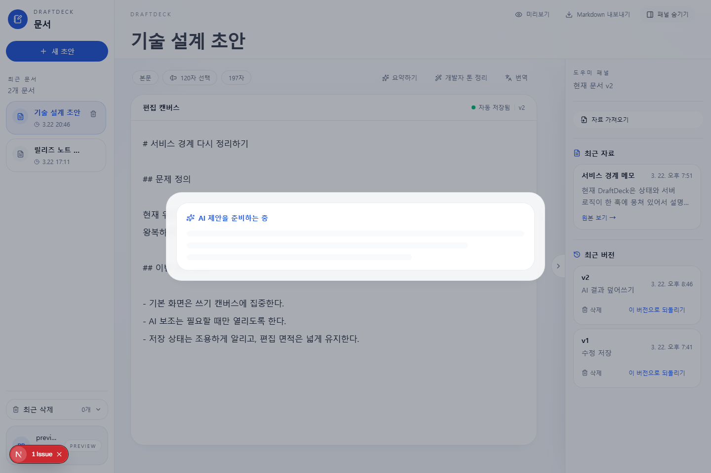
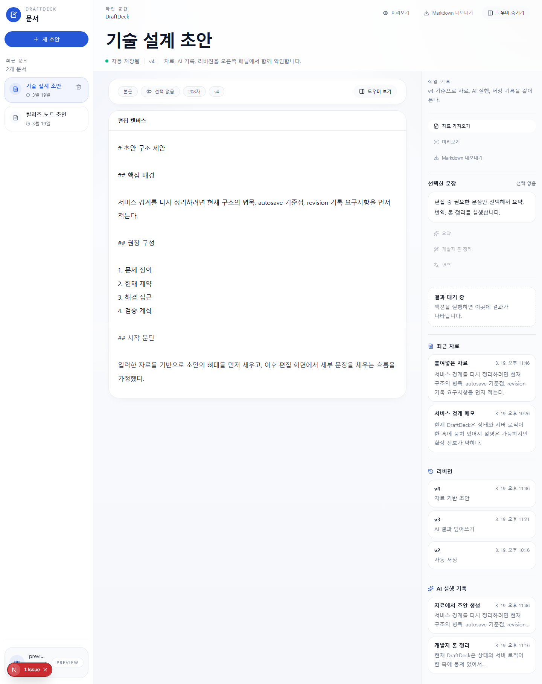

# DraftDeck

DraftDeck은 범용 AI writer가 아니라 `기술 글 초안 워크플로우`를 위한 개인용 writing workspace입니다.  
핵심은 자료를 가져와 초안으로 구조화하고, 선택 기반 AI 리라이트와 autosave, revision 기록, Markdown export까지 한 흐름으로 이어주는 것입니다.

- Live app: [https://draft-flow-one.vercel.app](https://draft-flow-one.vercel.app)
- Live demo: [https://draft-flow-one.vercel.app/demo](https://draft-flow-one.vercel.app/demo)
- Repo: [https://github.com/jongha1230/DraftDeck](https://github.com/jongha1230/DraftDeck)
- Architecture note: [docs/architecture.md](./docs/architecture.md)
- Case study: [docs/case-study.md](./docs/case-study.md)
- AI safety: [docs/ai-safety.md](./docs/ai-safety.md)
- Autosave & revisions: [docs/autosave-and-revisions.md](./docs/autosave-and-revisions.md)
- Data model: [docs/data-model.md](./docs/data-model.md)
- MVP scope: [docs/mvp-scope.md](./docs/mvp-scope.md)
- QA checklist: [docs/qa-checklist.md](./docs/qa-checklist.md)
- Migration: [supabase/migrations/20260319_draftdeck_supporting_upgrade.sql](./supabase/migrations/20260319_draftdeck_supporting_upgrade.sql)

## Quick Overview

- Problem:
  - 자료 import, 초안 작성, 선택 기반 AI 편집, autosave, revision 추적이 따로 놀면 writing workflow를 설명하기 어렵다.
- Key features:
  - source import, source 기반 draft generation, selection-based AI editing, autosave + revision history, Markdown export
- Tech stack:
  - Next.js 16, React 19, TypeScript, Zustand, Supabase, Gemini API, Vitest, Playwright
- Architecture highlights:
  - server action boundary, Supabase persistence layer, explicit AI service, client-side session store, preview/demo mode
- Testing & quality:
  - Vitest unit tests, Playwright demo flow, mocked AI tests, revision conflict coverage, import limit validation
- Known limitations:
  - real-time collaboration, multi-device sync, analytics, PDF export, full prompt injection prevention은 범위 밖이다.

## Product Focus

DraftDeck이 해결하려는 문제는 단순합니다.

- 메모와 자료를 초안 구조로 옮기는 데 시간이 오래 걸린다.
- 이미 쓴 문장을 요약, 번역, 리라이트하는 동안 맥락이 자주 끊긴다.
- 저장, 미리보기, 수정 이력이 분리돼 있으면 작성 흐름을 설명하기 어렵다.

그래서 제품 범위를 아래로 고정했습니다.

1. source import
2. source 기반 draft generation
3. selection-based AI editing
4. autosave + revision tracking
5. Markdown export

협업, 멀티디바이스 sync, analytics, PDF export는 이번 범위에서 제외했습니다.

## Screenshots

### Login



### Workspace



### Source Import



### Source Preview



### AI Apply



### Revision History



## Why This Is Different

이 프로젝트는 `AI 버튼 몇 개 붙인 에디터`처럼 보이지 않도록 아래 구조를 넣었습니다.

- `posts.revision_number`
  - autosave 시점의 optimistic save 기준점
- `draft_sources`
  - 초안이 어떤 자료에서 출발했는지 기록
- `ai_runs`
  - 어떤 액션을 어떤 입력으로 실행했는지 기록
- `draft_revisions`
  - autosave, AI apply, source import를 revision으로 남김

UI에서도 이 구조가 드러나도록 오른쪽 패널에서 `가져온 자료`와 `최근 버전`을 같이 보여줍니다.

## Architecture

### 1. Server boundary

- `src/app/actions.ts`
  - 클라이언트에서 호출하는 서버 액션 entrypoint
- `src/lib/drafts/persistence.ts`
  - 문서 CRUD, source 기록, revision 기록, artifact 조회
- `src/lib/ai/service.ts`
  - Gemini 호출, soft quota, ai run 기록

### 2. Client session

- `src/store/useDraftStore.ts`
  - 현재 문서, artifact, toast, panel 상태만 보관
- `src/hooks/useDraftPageController.ts`
  - autosave queue, preview hydration, import/AI/apply orchestration

### 3. Preview mode

- auth를 끄지 않고 UI만 빠르게 검증하기 위한 bypass
- localStorage에 preview session을 저장해 새로고침 후에도 흐름 유지
- local:
  - `NEXT_PUBLIC_DRAFTDECK_UI_PREVIEW=1`
- query:
  - local dev 또는 Vercel preview 환경에서 `/?draftdeck-preview=1`

## Guest Demo

- public guest demo는 `/demo`로 바로 들어갈 수 있습니다.
- source import, AI apply, revision history를 로그인 없이 한 흐름으로 체험할 수 있습니다.
- guest demo 세션은 브라우저 localStorage에만 저장됩니다.
- demo 안의 AI 결과는 실제 모델 호출이 아니라 로컬 preview 예시 결과입니다.

## Troubleshooting

### 1. 텍스트 선택 UX가 드래그 중간에 흔들리던 문제

처음에는 문장을 드래그하는 동안 선택 상태를 바로바로 반영하는 쪽이 더 인터랙티브하다고 봤습니다. 하지만 실제로는 `textarea`의 native selection과 React 상태 업데이트가 계속 부딪히면서, 선택 영역이 흔들리거나 버튼을 눌렀을 때 selection snapshot이 비어 보이는 경우가 생겼습니다.

그래서 selection을 드래그 중 실시간으로 반영하지 않고, `pointerup` 이후 한 번만 확정하는 구조로 바꿨습니다. 결과적으로 UI는 덜 요란해졌고, 선택 후 `요약하기 / 개발자 톤 정리 / 번역` 액션이 훨씬 안정적으로 동작하게 됐습니다.

### 2. autosave와 사용자용 최근 버전이 섞이던 문제

한 글자만 바뀌어도 autosave는 돌아야 합니다. 문제는 그 저장을 그대로 `최근 버전 vN`처럼 보여주면, 사용자가 실제로 되돌릴 가치가 있는 체크포인트와 단순 저장 상태를 구분할 수 없다는 점이었습니다.

그래서 `자동 저장`과 `최근 버전`을 분리했습니다. autosave는 계속 DB를 최신 상태로 밀어주지만, 사용자에게 보이는 최근 버전은 `의미 있는 수정`이나 `AI 결과를 실제 적용한 경우`에만 생성되도록 체크포인트 기준을 분리했습니다. 이 분리 덕분에 저장 상태는 즉시 알리면서도, 버전 히스토리는 되돌릴 가치가 있는 기록만 남길 수 있게 됐습니다.

### 3. Vercel/CI에서 브라우저 Supabase 초기화가 깨지던 문제

로컬에서는 잘 동작했지만, `/login` 프리렌더 단계에서 브라우저용 Supabase 클라이언트를 바로 만드는 코드가 `NEXT_PUBLIC_SUPABASE_*` 값이 없는 환경에서 터졌습니다. 특히 Vercel preview나 CI처럼 환경이 덜 갖춰진 곳에서 문제가 드러났습니다.

그래서 브라우저 클라이언트는 env가 있을 때만 만들고, 로그인 버튼도 클릭 시점에만 Supabase 초기화를 타도록 바꿨습니다. 덕분에 로컬 개발 환경과 배포 환경의 동작 차이를 줄였고, `lint/typecheck/test/build`와 배포 검증이 훨씬 안정적으로 통과하게 됐습니다.

## Verification

현재 기본 검증 명령은 아래입니다.

```bash
npm run lint
npm run typecheck
npm run test
npm run build
```

추가로 README 캡처 자산은 아래 명령으로 다시 만들 수 있습니다.

```bash
npm run capture:screenshots
```

## Local Development

```bash
npm install
npm run dev
```

`.env.local`

```bash
GEMINI_API_KEY=...
NEXT_PUBLIC_SUPABASE_URL=...
NEXT_PUBLIC_SUPABASE_PUBLISHABLE_KEY=...
NEXT_PUBLIC_SUPABASE_ANON_KEY=...
```

## Schema Upgrade

새 revision/source/ai-run 구조는 아래 migration 기준입니다.

```text
supabase/migrations/20260319_draftdeck_supporting_upgrade.sql
```

추가되는 항목:

- `posts.revision_number`
- `draft_sources`
- `ai_runs`
- `draft_revisions`

아직 migration이 적용되지 않은 환경에서도 앱이 완전히 깨지지 않도록, 선택 기록 테이블은 합성 객체로 fallback 하도록 만들었습니다. 다만 면접용 설명과 실제 데이터 추적을 위해서는 migration 적용이 전제입니다.

## Tech Stack

- Next.js 16
- React 19 + TypeScript
- Zustand
- Supabase
- Gemini API
- Vitest
- Playwright
- Tailwind CSS
